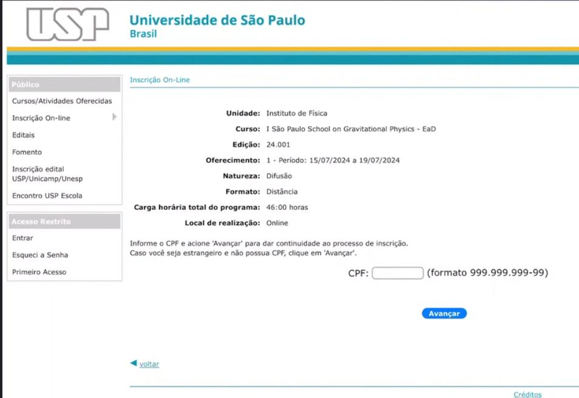
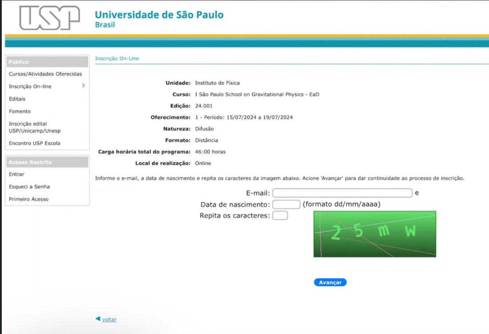
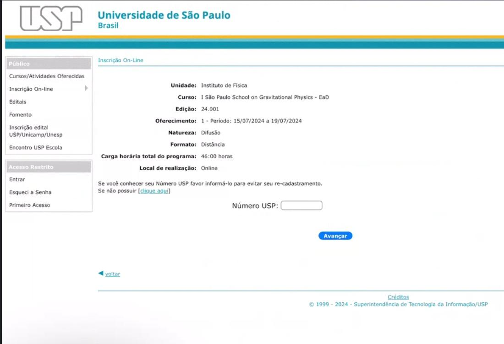
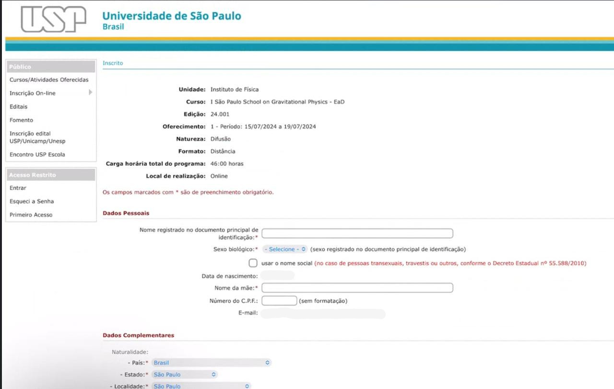
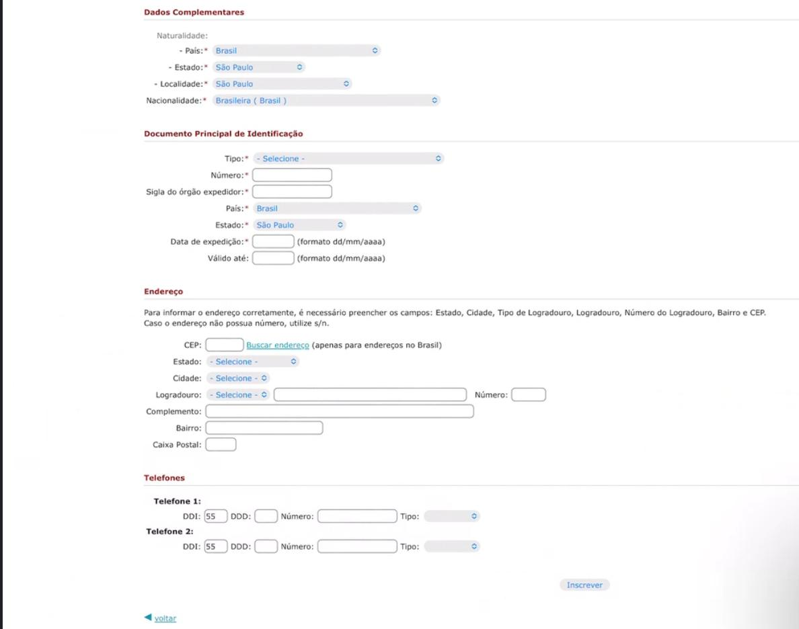
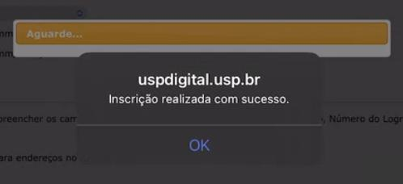
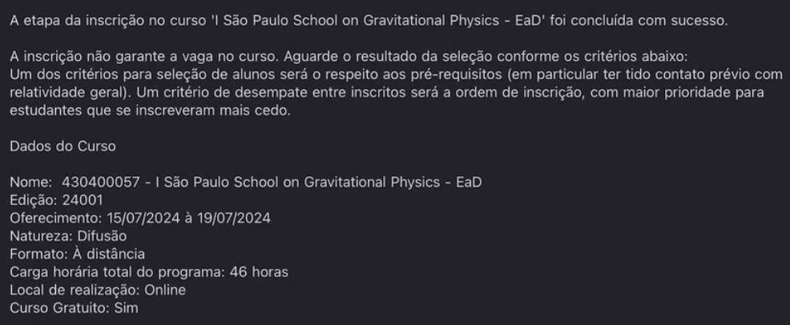

# Registration Guide

Currently, the registration system at the University of São Paulo (USP) is written in Portuguese. For this reason, we provide the guide below on how to register to GraSP through the USP system. The system involves the creation of a "USP number", which is a code attributed to anyone that has ever had any affiliation with the University of São Paulo. If you ever attend another event or course at USP, your USP number will still be the same. Due to this, and due to the way Brazilian bureaucracy works, the system requires a number of personal data that is not directly relevant to the school (and which will not be made available to the school organizers), but which is deemed necessary by the university to avoid problems with homonyms. We thank you for your understanding and make ourselves available for any inquiries about this process through the e-mail address [graspschool@gmail.com](mailto:graspschool@gmail.com).

Please follow the instructions below to perform your registration to the school. 

**Step 1:** accessing the website 

The registration website is available [at this link](https://uspdigital.usp.br/apolo/inscricaoPublicaFormTurmaListar?codund=43&codcurceu=430400057&codedicurceu=24001&numseqofeedi=1&oriins=W). When you click on it, you will be shown the following page.

The only field to be entered is the Brazilian CPF, which is a form of Brazilian ID. This step can be skipped by clicking in the button reading "Avançar", which means to proceed. 

**Step 2:** e-mail and date of birth

The next page to be shown is the following.

The first field asks you for your e-mail (this is the e-mail which will be used for official school communication). The second field asks for your date of birth in the dd/mm/yyyy format. Finally, the third and last field is intended for you to complete the captcha check by typing in the characters shown in the picture. Once the three fields are filled, please click the "Avançar" button to proceed to the next page.

**Step 3:** USP number

The third page is the following.

This page asks for your USP number, in case you have one. 

If you do have a USP number, please inform it to avoid creating a new USP number for you in the USP system and then click the "Avançar" button to proceed to the next page. The next page will then be the last one and requires you only to check your data and confirm the registration. Then skip to Step 5.

If you do not have a USP number, leave the field blank. Click the blue hyperlink reading "clique aqui" which is above the entry field, to the left of the page, inside square brackets. Then proceed to step 4.

**Step 4:** personal data 

In case you don't have a USP number, this should be the last page. The first part of the page is the following.

The first block of entries is "Dados Pessoais" (personal data). The first entry asks for your name as registered in your ID. The following entry, which is a dropdown box, asks for your gender as specified in your ID, the options being "Masculino" (male) and "Feminino" (female). If you do not use your name as given in your ID socially, the clickable box below this option allows you to inform your "social name", i.e., the name which you would rather use. Next you should find your filled-in date of birth. Below it, the entry "nome da mãe" asks for your mother's name. The next entry, for a CPF number, can be left unfilled, and below it you should find your e-mail. 

The next picture shows the remaining of the page.

The second block of the page, labelled "Dados Complementares" (complementary data) asks for information about your citizenship. The first dropdown box asks for your country. If you do not enter "Brazil", the second and third options should disappear. The remaining entry ("Nacionalidade", which means citizenship) asks for your citizenship. 

The third block in the page is called "Documento Principal de Identificação" (main ID). In the "Tipo" dropdown, please select "Passaporte" (passport) or "Documento de Identidade Estrangeiro" (non-Brazilian ID). The second entry ("Número") asks for the number of your document (your passport or your non-Brazilian ID). You can leave "EXT" in the third entry. The dropdown "País" asks for your country. "Data de expedição" is the date in which your document was issued (in the dd/mm/yyyy format), and "Válido até" is the expiration date for your document (in the dd/mm/yyyy format). Although the system does not mark the expiration date as mandatory, we were informed by some participants that it is indeed mandatory.

The last two blocks ask for an address and for telephone numbers. These are not mandatory and can be left empty. 

After you click the button at the bottom of the page, you should receive a pop-up message similar to the following one.

**Step 5:** confirmation e-mail

At this point, we expect the registration process to be complete. You should receive an e-mail similar to the following one. 

The e-mail confirms that you registered to the school. It also states that in principle the registration is subject to acceptance by the organizing committee. While in principle this acceptance will be made in terms of the participant's previous experience with general relativity, we expect the virtual rooms to have more slots available than there will be participants. Therefore, we currently plan on accepting all registrations. 

**Course selection form:** The registration system provided by the University of São Paulo cannot deal with the selection of minicourses within a larger event. For this reason, we created [this form](https://forms.gle/mvNoXsiyR5Z2TtfQ6) for you to select the minicourses of your interest. We apologize for the inconvenience.
